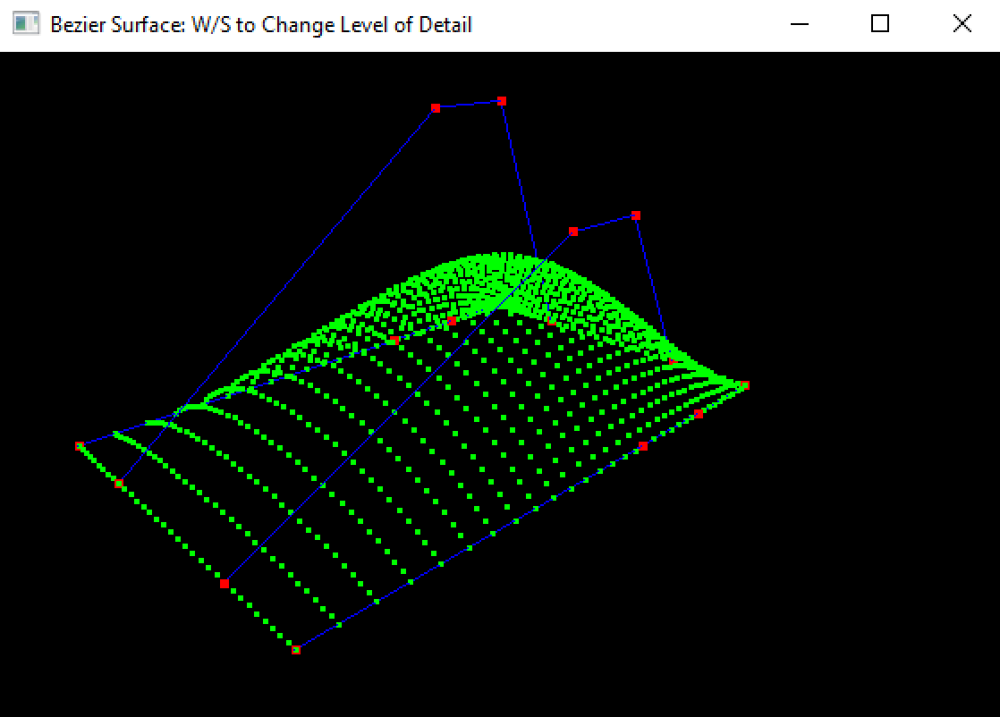
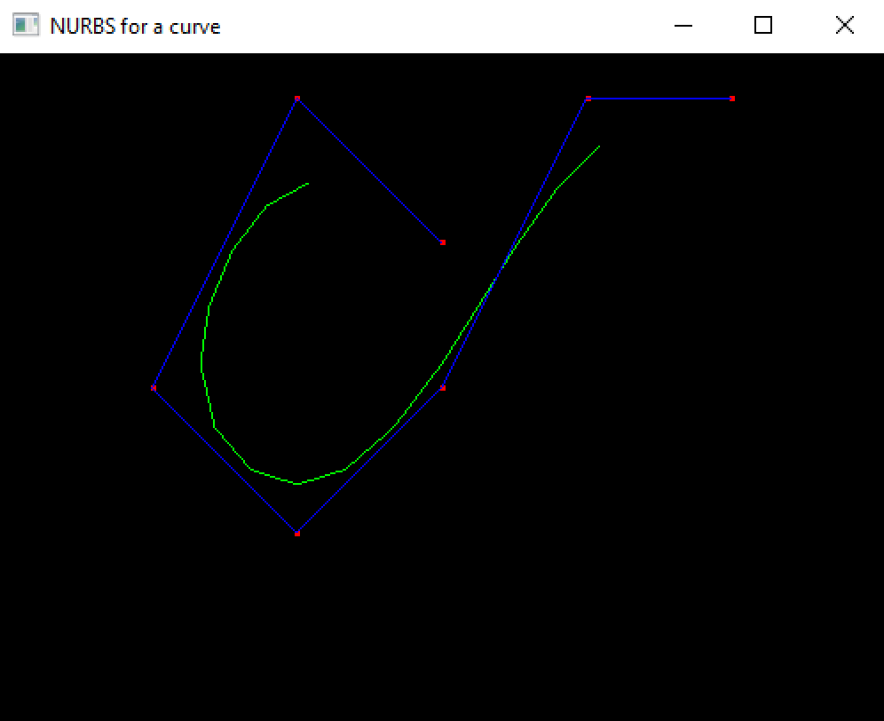
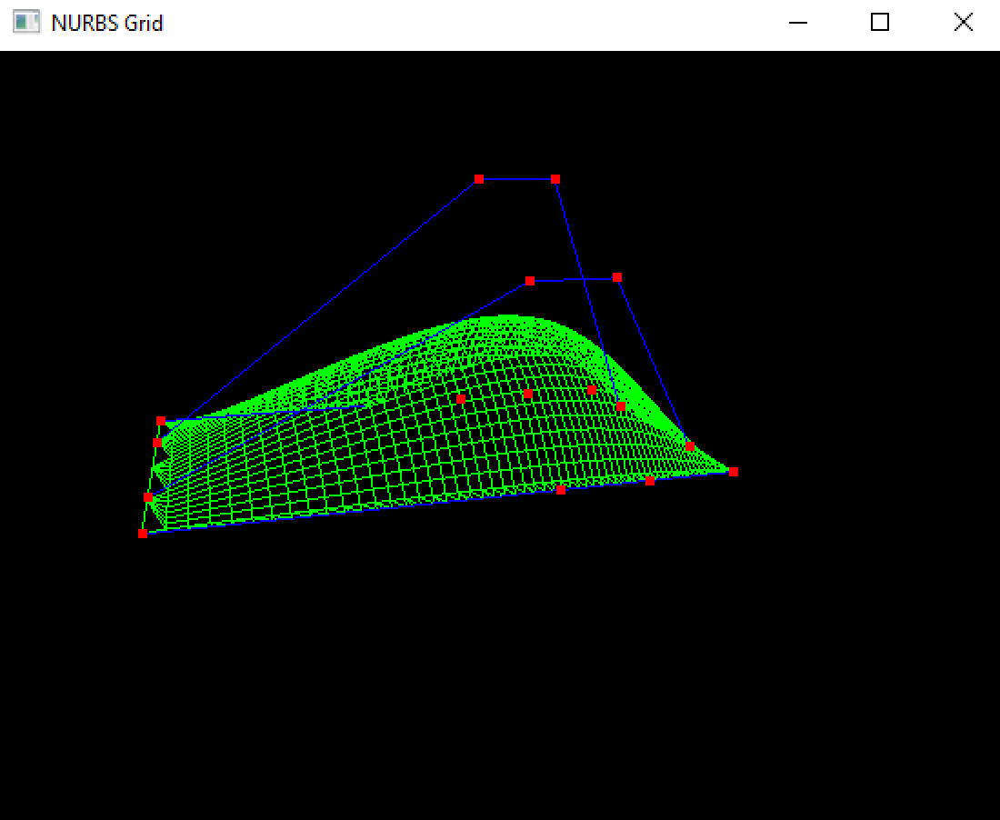
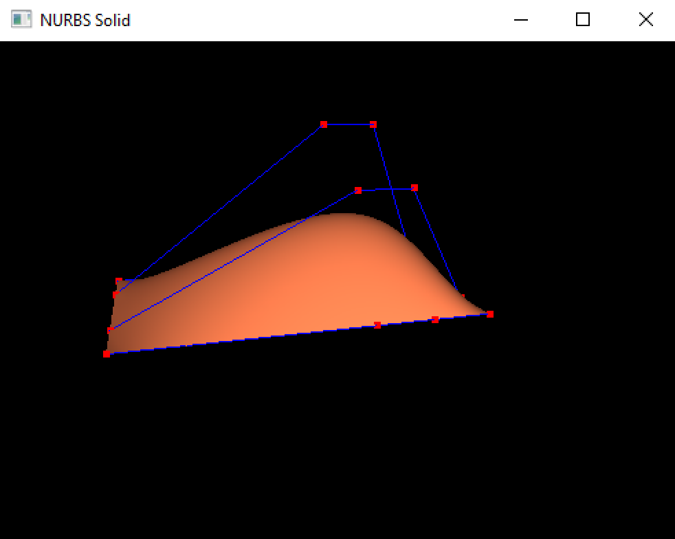
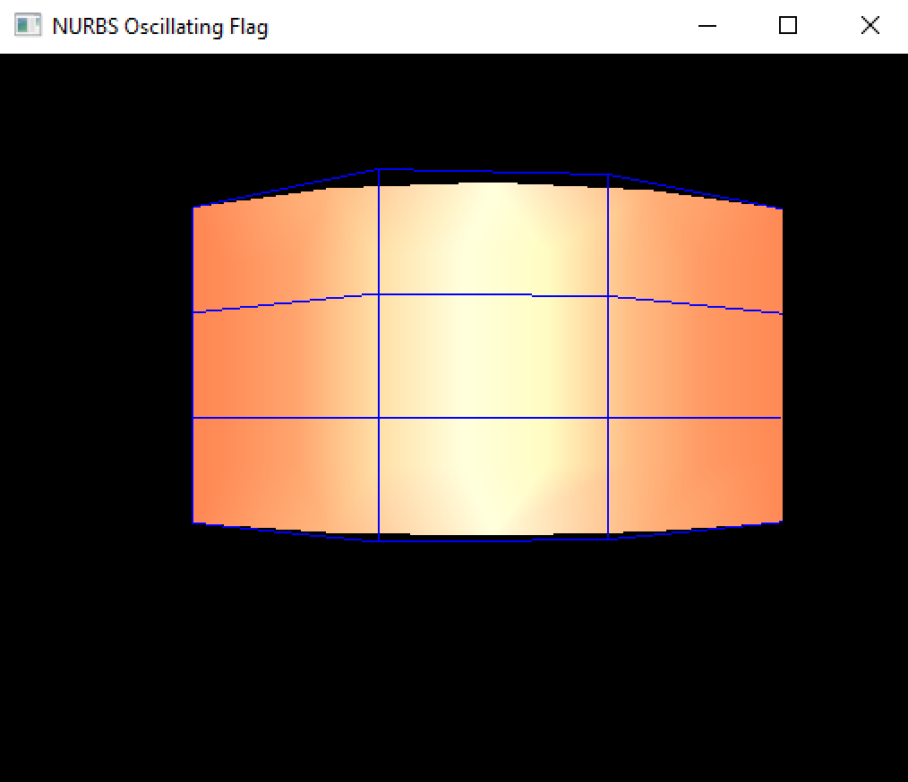

* surface_bezier.cpp - Surface created from scratch with two Bezier Curves

  

* nurbs_curve.cpp - A curve using NURBS interface

  

* nurbs_surface_grid.cpp - A surface using NURBS interface (only lines)

  

* nurbs_surface_solid.cpp - A surface using NURBS interface (with light and materials)

  

* nurbs_flag.cpp - A surface using NURBS interface (animated)

  

